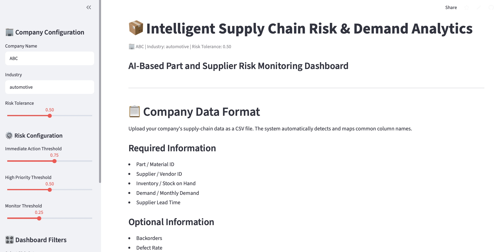
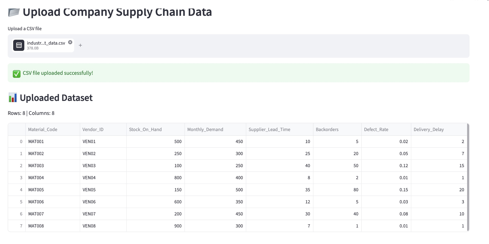
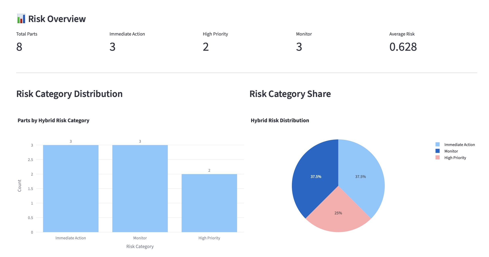
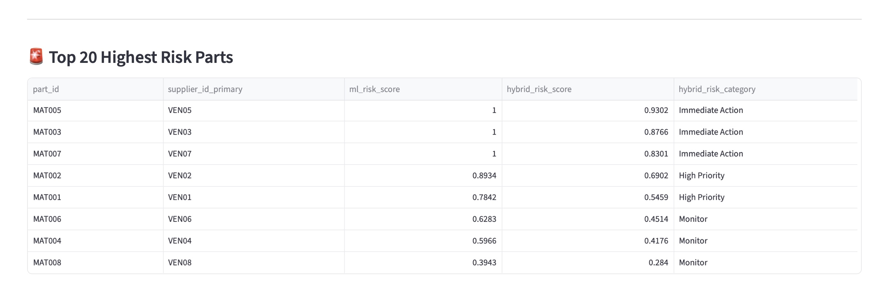
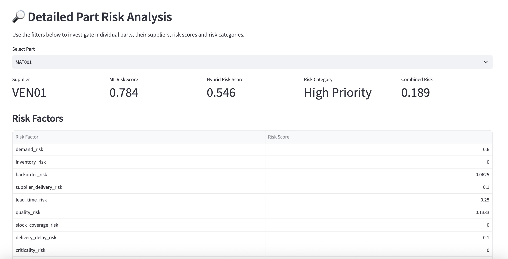

# 🚀 Intelligent Supply Chain Risk & Demand Analytics System

> An AI and data-driven supply-chain risk monitoring system for identifying, analyzing, and prioritizing part and supplier risks.

<p align="center">

[](https://intelligent-supply-chain-risk-dashboard-nc8rodv4utmpbtl5e3pp4q.streamlit.app)
[](https://www.python.org/)
[](https://streamlit.io/)
[](https://scikit-learn.org/)

</p>

---

# 🌐 Live Demo

### 👉 [Open the Live Streamlit Dashboard](https://intelligent-supply-chain-risk-dashboard-nc8rodv4utmpbtl5e3pp4q.streamlit.app)

The deployed dashboard allows users to:

- Upload company-specific supply-chain CSV data
- Automatically detect and map common column names
- Validate uploaded data
- Calculate adaptive rule-based risk
- Generate machine-learning risk predictions
- Calculate a Hybrid Risk Score
- Analyze part-level and supplier-level risks
- Identify major risk drivers
- Generate business recommendations
- Filter results by supplier and risk category
- Export filtered results as CSV

---

# 📌 Problem Statement

Modern supply chains are affected by:

- Demand fluctuations
- Inventory shortages
- Supplier delays
- Backorders
- Quality issues
- Long supplier lead times

These factors can increase operational risk and negatively affect business performance.

The **Intelligent Supply Chain Risk & Demand Analytics System** is an AI and data-driven dashboard designed to identify, analyze, monitor, and prioritize supply-chain risks at both **part and supplier levels**.

The system combines **rule-based risk analysis** with **machine-learning predictions** to generate a **Hybrid Risk Score**, providing a more comprehensive view of supply-chain risk.

---

# 🎯 Project Objectives

The primary objectives of the system are to:

1. Identify high-risk parts and suppliers.
2. Analyze inventory and demand-related risk.
3. Evaluate supplier-related operational risk.
4. Combine business rules with machine-learning predictions.
5. Generate an interpretable Hybrid Risk Score.
6. Categorize risks according to configurable thresholds.
7. Explain the major factors contributing to risk.
8. Provide actionable business recommendations.
9. Support company-specific CSV uploads.
10. Provide an interactive dashboard for decision support.

---

# ✨ Key Features

## 📂 Company Data Upload

- Upload company-specific supply-chain CSV files.
- Supports different column naming conventions.
- Automatically maps recognized columns to the internal schema.

## 🔍 Data Validation

The system performs several validation checks:

- Empty dataset detection
- Duplicate-row detection
- Missing-value checks
- Essential-field validation
- Upload quality reporting

## 📊 Adaptive Rule-Based Risk Engine

The rule-based engine evaluates available supply-chain factors such as:

- Demand
- Inventory
- Lead time
- Stock coverage
- Backorders
- Defect rate
- Delivery delays

The scoring system adapts to the fields available in the uploaded dataset.

## 🤖 Machine-Learning Risk Prediction

The system uses a trained machine-learning pipeline containing:

- Trained risk model
- Feature scaler
- Model feature list

These artifacts are stored in the `models/` directory and loaded during prediction.

## 🔀 Hybrid Risk Score

The system combines rule-based and machine-learning risk signals.

**Hybrid Risk Score = 0.40 × Rule-Based Risk + 0.60 × ML Risk**

The final score is constrained between **0 and 1**.

## 🚨 Risk Classification

| Risk Score | Category |
|---|---|
| `< 0.25` | 🟢 Normal |
| `0.25 – < 0.50` | 🟡 Monitor |
| `0.50 – < 0.75` | 🟠 High Priority |
| `≥ 0.75` | 🔴 Immediate Action |

Risk thresholds can be configured directly from the dashboard.

## 🏭 Supplier-Level Analysis

The dashboard provides supplier-level insights including:

- Supplier risk distribution
- Risk concentration
- Supplier comparison
- High-risk supplier identification

## 🔧 Part-Level Risk Analysis

Users can investigate individual parts and examine:

- Hybrid risk score
- ML risk score
- Risk category
- Risk drivers
- Operational context
- Combined risk
- Recommended actions

## 💡 Explainable Risk Drivers

The dashboard identifies important factors contributing to individual part risks and provides contextual recommendations.

## 📈 Interactive Dashboard

The Streamlit dashboard provides:

- Risk KPIs
- Risk distribution charts
- Risk score analysis
- Supplier analysis
- Part-level analysis
- Risk-driver analysis
- Business recommendations
- Interactive filters

## 📥 CSV Export

Users can filter dashboard results and export the resulting risk predictions as CSV.

---

# 📸 Dashboard Screenshots

## 1. Company Configuration

The dashboard allows users to configure company information and risk thresholds.



---

## 2. Company Supply Chain Data Upload

Users can upload a company-specific CSV file. The system validates and displays the uploaded dataset.



---

## 3. Risk Overview

The Risk Overview section provides a high-level summary of supply-chain risk, including total parts, immediate-action parts, high-priority parts, monitored parts, and average risk.



---

## 4. Highest Risk Parts

The dashboard identifies and displays the highest-risk parts along with their suppliers, ML risk scores, Hybrid Risk Scores, and risk categories.



---

## 5. Detailed Part Risk Analysis

Users can select an individual part to investigate its supplier, ML risk score, Hybrid Risk Score, risk category, combined risk, and individual risk factors.



> All dashboard screenshots are stored in the `screenshots/` directory.

---

# 🏗️ System Architecture

```text
                   ┌──────────────────────────┐
                   │   Included Dataset       │
                   │   or Company CSV Upload  │
                   └────────────┬─────────────┘
                                │
                                ▼
                   ┌──────────────────────────┐
                   │ Data Validation &        │
                   │ Column Mapping            │
                   └────────────┬─────────────┘
                                │
                  ┌─────────────┴─────────────┐
                  │                           │
                  ▼                           ▼
         ┌─────────────────┐         ┌─────────────────┐
         │ Rule-Based      │         │ ML Prediction   │
         │ Risk Engine     │         │ Pipeline        │
         └────────┬────────┘         └────────┬────────┘
                  │                           │
                  └─────────────┬─────────────┘
                                ▼
                   ┌────────────────────────┐
                   │   Hybrid Risk Score    │
                   └────────────┬───────────┘
                                │
                                ▼
                   ┌────────────────────────┐
                   │ Risk Classification    │
                   │                        │
                   │ Normal                 │
                   │ Monitor                │
                   │ High Priority          │
                   │ Immediate Action       │
                   └────────────┬───────────┘
                                │
                                ▼
             ┌────────────────────────────────────┐
             │ Interactive Streamlit Dashboard    │
             │                                    │
             │ • KPIs                             │
             │ • Risk Charts                      │
             │ • Supplier Analysis                │
             │ • Part-Level Analysis              │
             │ • Risk Drivers                     │
             │ • Recommendations                  │
             │ • CSV Export                       │
             └────────────────────────────────────┘