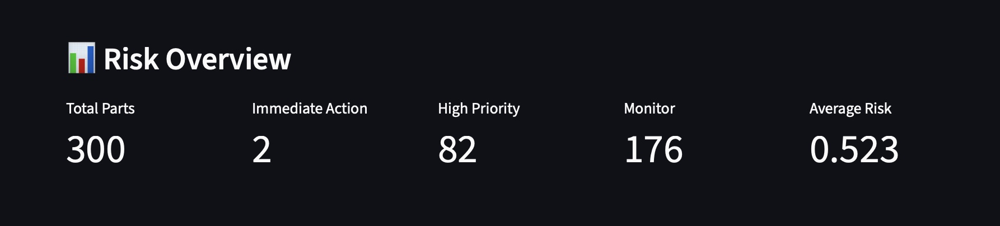
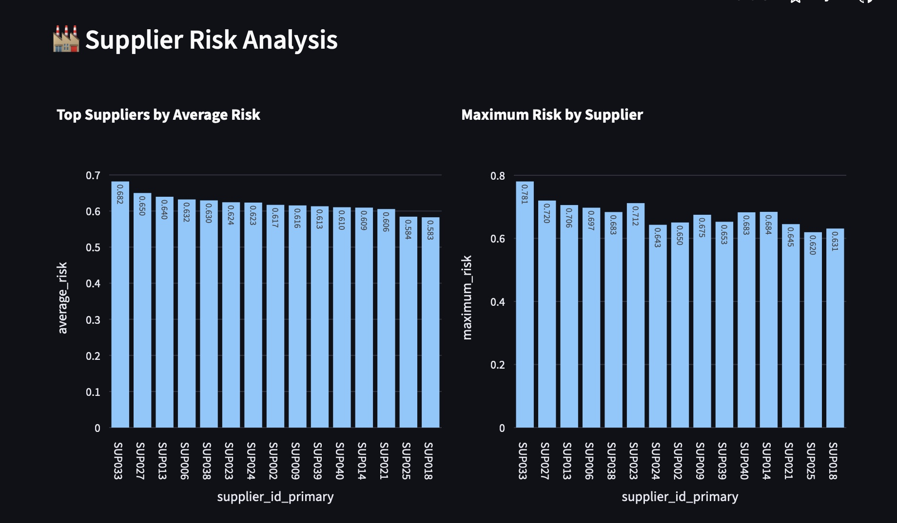
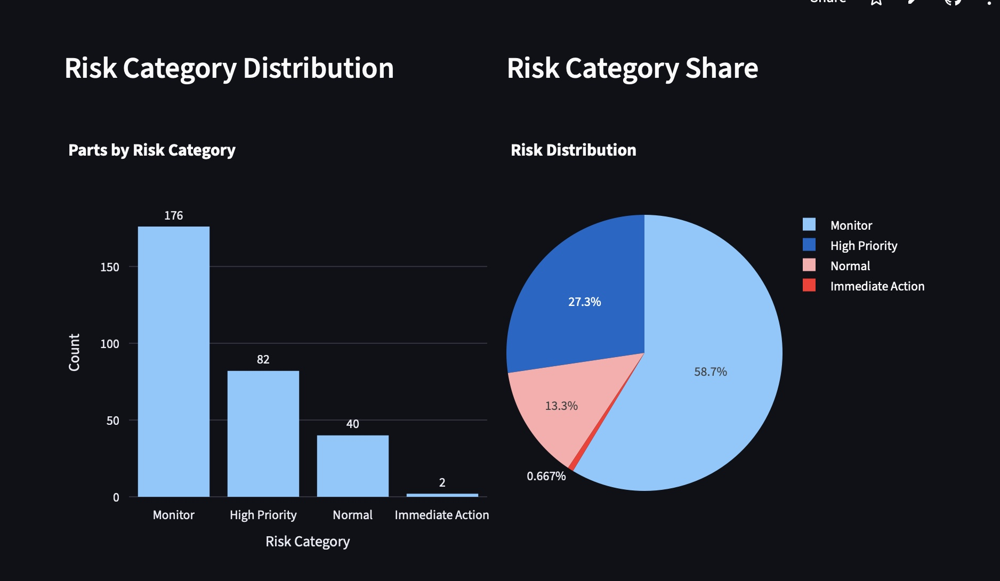
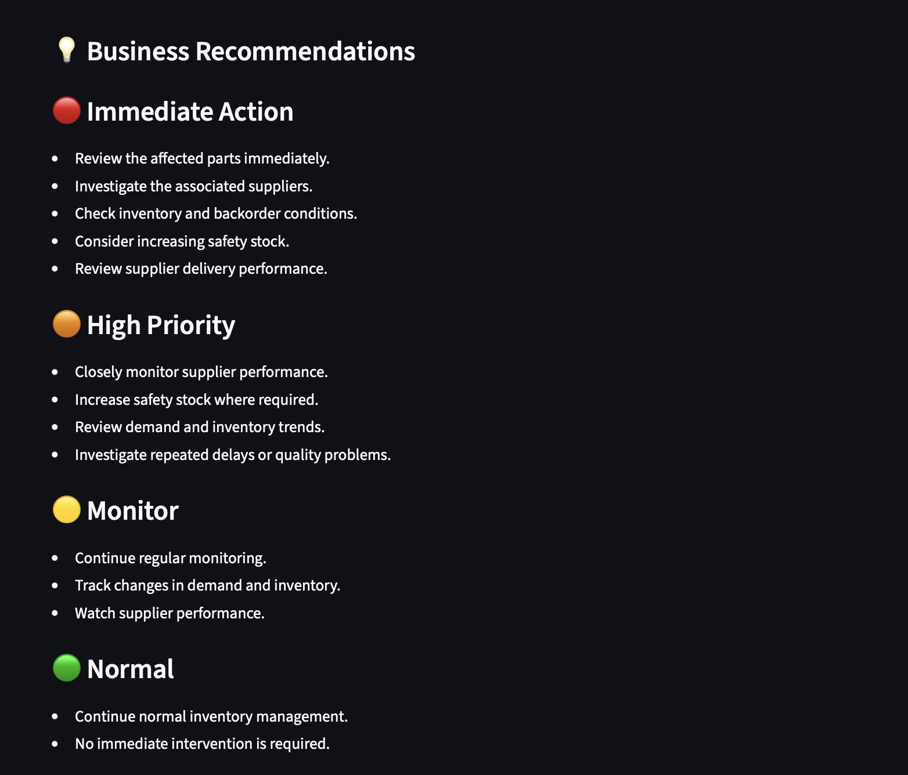

# Intelligent Supply Chain Risk & Demand Analytics

[🚀 Live Dashboard](https://intelligent-supply-chain-risk-dashboard-nc8rodv4utmpbtl5e3pp4q.streamlit.app)

An interactive Streamlit dashboard for identifying supply-chain risk at the part and supplier level. The project combines an adaptive rule-based engine with a trained machine-learning model to produce a hybrid risk score, explain the leading risk factors, and help teams focus on parts that need attention.

Built as a portfolio project, it demonstrates an end-to-end data workflow: source-data analysis, feature engineering and model artifacts, reusable risk-scoring components, and an interactive dashboard that accepts company CSV files.

## What the dashboard does

- Loads the included risk-prediction dataset or accepts a company CSV upload.
- Detects common company column names and maps them to a standard schema.
- Reports empty datasets, duplicate rows, and missing values during upload.
- Calculates adaptive rule-based risk from the fields available in the uploaded data.
- Generates an ML risk score using the bundled trained model, scaler, and feature list.
- Combines the two signals into a hybrid risk score.
- Classifies each part as **Normal**, **Monitor**, **High Priority**, or **Immediate Action**.
- Provides risk KPIs, category charts, score distribution, top-risk parts, and supplier-level summaries.
- Shows part-level risk drivers and contextual recommendations.
- Filters results by risk category and supplier, then exports the filtered results as CSV.

## Dashboard preview

| Overview | Supplier analysis |
| --- | --- |
|  |  |

| Risk distribution | Business recommendations |
| --- | --- |
|  |  |

## Workflow and architecture

```text
Included dataset or company CSV
            |
            v
Validation and column mapping
            |
            v
Rule-based risk engine -----------+
                                   |
                                   v
ML prediction pipeline ------> Hybrid risk score --> Category, dashboard, CSV export
```

1. The dashboard loads the bundled `data/final_risk_predictions.csv` by default, or validates a user-uploaded CSV.
2. For an upload, recognizable headers are standardized to the internal schema.
3. The rule-based engine scores applicable factors and normalizes their weights according to the factors present.
4. The ML pipeline builds the trained feature set, scales it with the saved scaler, and generates an ML risk score.
5. The hybrid layer combines both scores. The UI then applies the configurable risk thresholds used for dashboards and filtering.

## Risk methodology

### Rule-based scoring

The adaptive engine uses the data fields that are available. Its implemented factors are:

- demand level relative to the dataset average
- inventory level relative to the dataset average
- lead time
- stock coverage (inventory relative to demand)
- backorders, when supplied
- defect rate, when supplied
- delivery delay, when supplied

The engine re-normalizes its configured weights across the usable factors, so optional fields do not need to be present for scoring to continue.

### Machine-learning scoring

The app loads the following saved artifacts from `models/`:

- `best_risk_model.pkl`
- `risk_scaler.pkl`
- `model_features.pkl`

For uploaded data, the prediction module derives model features from the standardized columns. Where a model feature cannot be obtained from the upload, it is initialized to zero before scaling and prediction.

### Hybrid score and categories

The hybrid score is a weighted blend of the rule-based prediction and ML score:

```text
Hybrid risk = (0.40 × rule-based risk) + (0.60 × ML risk)
```

Scores are constrained to the 0–1 range. The default dashboard thresholds are configurable in the sidebar:

| Score range | Category |
| --- | --- |
| Below 0.25 | Normal |
| 0.25 to below 0.50 | Monitor |
| 0.50 to below 0.75 | High Priority |
| 0.75 and above | Immediate Action |

## Company CSV format

Use the in-app **Download Company CSV Template** button for a starter file. The dashboard expects the following business information and recognizes common aliases such as the examples below.

| Information | Example recognized headers | Needed for the full workflow |
| --- | --- | --- |
| Part / material identifier | `part_id`, `part_number`, `material_code`, `sku` | Yes |
| Supplier / vendor identifier | `supplier_id`, `supplier`, `vendor_id`, `vendor_code` | Yes |
| Inventory | `inventory`, `stock_on_hand`, `available_stock` | Yes |
| Demand | `demand`, `monthly_demand`, `forecast_demand` | Yes |
| Supplier lead time | `lead_time_days`, `supplier_lead_time`, `delivery_days` | Yes |
| Backorders | `backorders`, `backorder_qty`, `pending_orders` | Optional |
| Defect rate | `defect_rate`, `quality_rate`, `rejection_rate` | Optional |
| Delivery delay | `delivery_delay`, `delay_days`, `supplier_delay` | Optional |
| Criticality | `criticality`, `priority`, `part_criticality` | Optional |
| Unit cost | `unit_cost`, `item_cost`, `part_cost` | Optional |

Column names are matched case-insensitively after spaces and hyphens are converted to underscores. The upload validation surfaces duplicate rows and missing values; it does not modify the source file.

Example:

```csv
Material_Code,Vendor_ID,Stock_On_Hand,Monthly_Demand,Supplier_Lead_Time,Backorders,Defect_Rate,Delivery_Delay
MAT001,VEN01,500,450,10,5,0.02,2
MAT002,VEN02,250,300,25,20,0.05,7
```

## Tech stack

- **Python** — application and analytics code
- **Streamlit** — interactive dashboard and CSV upload/download controls
- **pandas** and **NumPy** — data preparation and calculations
- **scikit-learn** and **joblib** — model inference and persisted model artifacts
- **Plotly** — interactive visualizations
- **SQL** — supporting table, analysis, and risk-view scripts

## Project structure

```text
.
├── app.py                       # Streamlit dashboard entry point
├── data/                        # Source, derived, and demonstration datasets
├── models/                      # Trained model, scaler, and feature list
├── screenshots/                 # Dashboard screenshots
├── sql/                         # Table creation, analysis, and risk-view SQL
├── src/
│   ├── 01_parts_analysis.py     # Parts analysis workflow
│   ├── 02_supply_chain_analysis.py
│   ├── 03_ml_model.py           # Model-development workflow
│   ├── 03_purchase_orders_analysis.py
│   ├── 04_quality_analysis.py
│   └── industry/                # Upload, mapping, scoring, and ML modules
├── requirements.txt
├── test_company_data.csv        # Validation test fixture
└── README.md
```

## Run locally

Prerequisite: Python 3. The project dependencies are listed in `requirements.txt`.

```bash
git clone https://github.com/Intelligent-Supply-Chain/intelligent-supply-chain-risk-dashboard.git
cd intelligent-supply-chain-risk-dashboard

python3 -m venv .venv
source .venv/bin/activate
pip install -r requirements.txt

streamlit run app.py
```

Streamlit will display a local URL in the terminal. Open it in a browser, enter a company name in the sidebar, then either explore the included data or upload a CSV using the format above.

## Sample usage

1. Start the app with `streamlit run app.py`.
2. Enter a company name and optionally an industry.
3. Choose the risk thresholds that fit the review policy.
4. Upload a CSV or use the default dataset.
5. Review the high-risk parts, supplier summaries, and risk drivers.
6. Apply supplier or category filters and download the filtered predictions when needed.

## Streamlit deployment

The repository is structured for Streamlit deployment with `app.py` as the entry point and dependencies declared in `requirements.txt`. Ensure the `data/` and `models/` folders are included in the deployed repository because the dashboard loads the default dataset and model artifacts at runtime.

## Future enhancements

- Add automated tests that assert dashboard-level behaviour in addition to module-level checks.
- Add input-schema guidance and clearer upload errors for unrecognized essential fields.
- Support configurable hybrid weights and persisted organization-specific thresholds.
- Add historical trend views and comparisons across reporting periods.
- Integrate data sources or databases for scheduled refreshes instead of CSV-only uploads.
- Add model monitoring and retraining workflows as new supply-chain data becomes available.

## Repository assets

- `data/industry_test_data.csv` provides an example of the company-data schema.
- `test_company_data.csv` is a small fixture used to exercise validation cases such as missing values and duplicate rows.
- `screenshots/` contains the dashboard images shown above.

---

This project is intended as an analytics and decision-support demonstration. Risk scores should be reviewed alongside operational context before taking business action.
